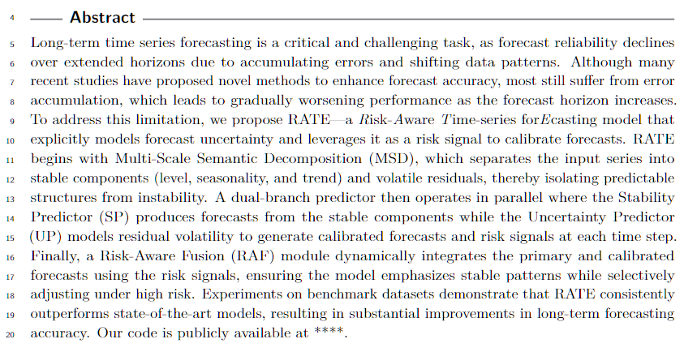
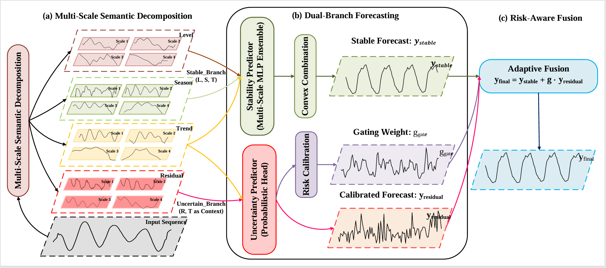
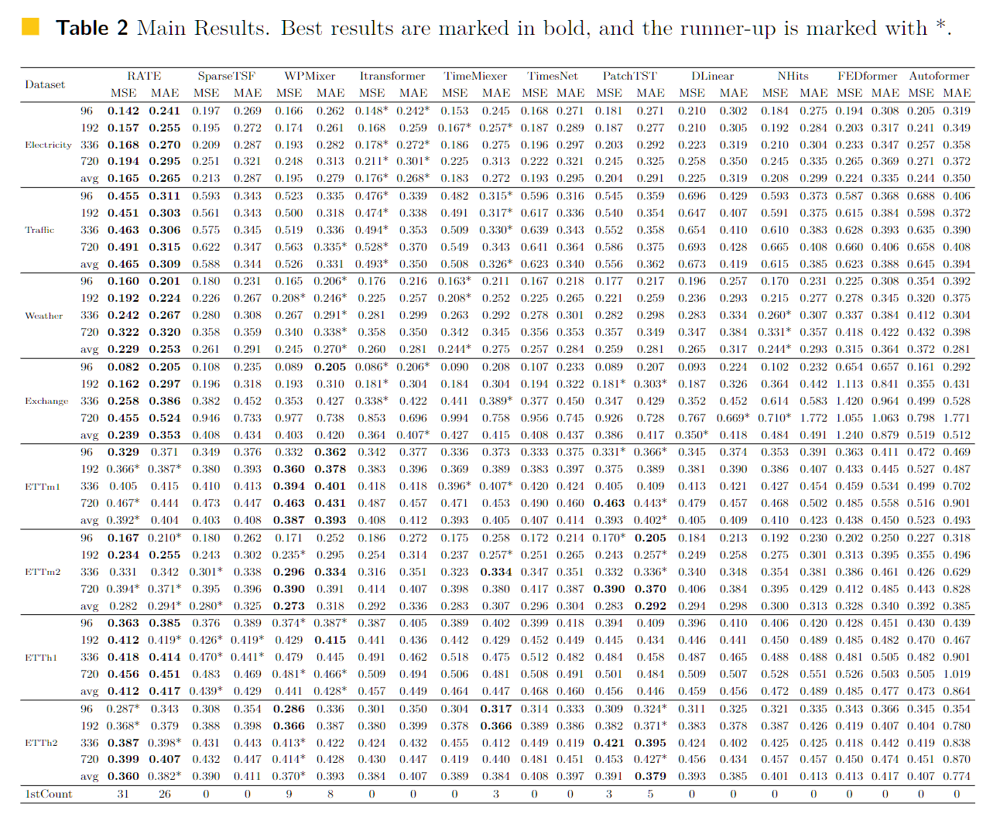

# RATE:  A Risk-Aware Adaptive Long-term Time Series Forecasting Method

<div align="center">

<p><a href="https://arxiv.org/abs/XXXX.XXXXX"><strong>Full Paper (ARXIV)</strong></a></p>

<hr style="border: 1px solid  #256ae2 ;">

`<a href='https://arxiv.org/abs/XXXX.XXXXX'>``</a>`


</div>

```bibtex
@article{yourname2025RATE,
  title={RATE: A Risk-Aware Adaptive Long-term Time Series Forecasting Method},
  author={Author 1 and Author 2 and Author 3},
  journal={arXiv preprint arXiv:XXXX.XXXXX},
  year={2025}
}
```

## 🔄 Updates

- **[Month Year]** Initial release of RATE.

## Get started

Follow these steps to get started with RATE:

### 1. Install Requirements

It is recommended to use Python 3.8 or higher. Install the necessary dependencies using pip.

```bash
pip install -r requirements.txt
```

A `requirements.txt` file could contain:

```
numpy
pandas
torch
scikit-learn
matplotlib
scipy
```

### 2. Download Data

Download the datasets from a source like [Autoformer](https://github.com/thuml/Autoformer). Place the downloaded data into a `./dataset/` folder in the root directory. The directory should have the following structure:

```
dataset
├── electricity
│   └── electricity.csv
├── ETT-small
│   ├── ETTh1.csv
│   ├── ETTh2.csv
│   ├── ETTm1.csv
│   └── ETTm2.csv
├── exchange_rate
│   └── exchange_rate.csv
├── traffic
│   └── traffic.csv
└── weather
    └── weather.csv
```

### 3. Train the model

We provide experiment scripts for all benchmarks under the root folder to reproduce the results. Running these scripts will train the model and save logs and results.

#### Multivariate long-term forecasting results with unified settings:

```bash
bash ./scripts/long_term_forecast/RATE_ETTh1_unify
bash ./scripts/long_term_forecast/RATE_ETTh2_unify.sh
bash ./scripts/long_term_forecast/RATE_ETTm1_unify.sh
bash ./scripts/long_term_forecast/RATE_ETTm2_unify.sh
bash ./scripts/long_term_forecast/RATE_ecl_unify.sh
bash ./scripts/long_term_forecast/RATE_weather_unify.sh
bash ./scripts/long_term_forecast/RATE_exchange_unify.sh
bash ./scripts/long_term_forecast/RATE_traffic_unify.sh
```

<hr style="border: 1px solid #FF5733;">

<h1 align="center" style="color: #256ae2 ;">Brief Overview of the Paper</h1>

<hr style="border: 1px solid #FF5733;">

<p><strong>Abstract:</p>
<p align="center">
  <a href="pic/Arc.pdf">
    
  </a>
</p>
<p><strong>Model Architecture:</p>
<p align="center">
  
</p>


<p><strong>Main Results:</p>
<p align="center">
  
</p>